**document:**

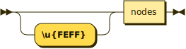

```
document ::= '\u{FEFF}'? nodes
```

**nodes:**

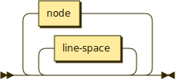

```
nodes    ::= line-space* ( node line-space* )*
```

referenced by:

* document
* node-children

**node:**

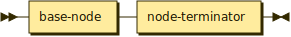

```
node     ::= base-node node-terminator
```

referenced by:

* nodes

**final-node:**

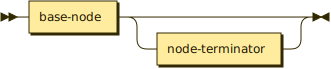

```
final-node
         ::= base-node node-terminator?
```

referenced by:

* node-children

**base-node:**


```
base-node
         ::= slashdash? type? node-space* string ( node-space+ slashdash? node-prop-or-arg )* ( node-space+ slashdash node-children )* ( node-space+ node-children )? ( node-space+ slashdash node-children )* node-space*
```

referenced by:

* final-node
* node

**node-prop-or-arg:**

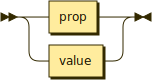

```
node-prop-or-arg
         ::= prop
           | value
```

referenced by:

* base-node

**node-children:**

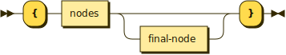

```
node-children
         ::= '{' nodes final-node? '}'
```

referenced by:

* base-node

**node-terminator:**

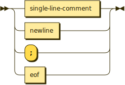

```
node-terminator
         ::= single-line-comment
           | newline
           | ';'
           | eof
```

referenced by:

* final-node
* node

**prop:**

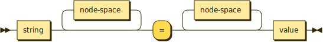

```
prop     ::= string node-space* '=' node-space* value
```

referenced by:

* node-prop-or-arg

**value:**

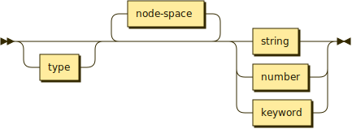

```
value    ::= type? node-space* ( string | number | keyword )
```

referenced by:

* node-prop-or-arg
* prop

**type:**

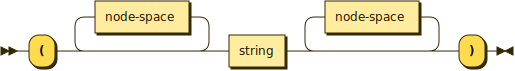

```
type     ::= '(' node-space* string node-space* ')'
```

referenced by:

* base-node
* value

**string:**

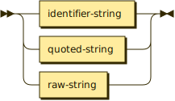

```
string   ::= identifier-string
           | quoted-string
           | raw-string
```

referenced by:

* base-node
* prop
* type
* value

**identifier-string:**

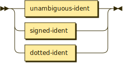

```
identifier-string
         ::= unambiguous-ident
           | signed-ident
           | dotted-ident
```

referenced by:

* string

**quoted-string:**

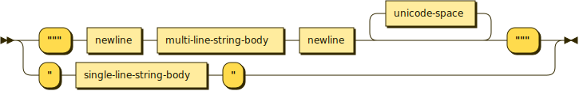

```
quoted-string
         ::= '"' single-line-string-body '"'
           | '"""' newline multi-line-string-body newline unicode-space* '"""'
```

referenced by:

* string

**single-line-string-body:**

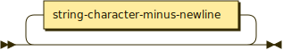

```
single-line-string-body
         ::= string-character-minus-newline*
```

referenced by:

* quoted-string

**multi-line-string-body:**

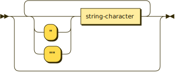

```
multi-line-string-body
         ::= ( ( '"' | '""' )? string-character )*
```

referenced by:

* quoted-string

**string-character:**

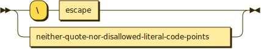

```
string-character
         ::= '\' escape
           | neither-quote-nor-disallowed-literal-code-points
```

referenced by:

* multi-line-string-body

**escape:**

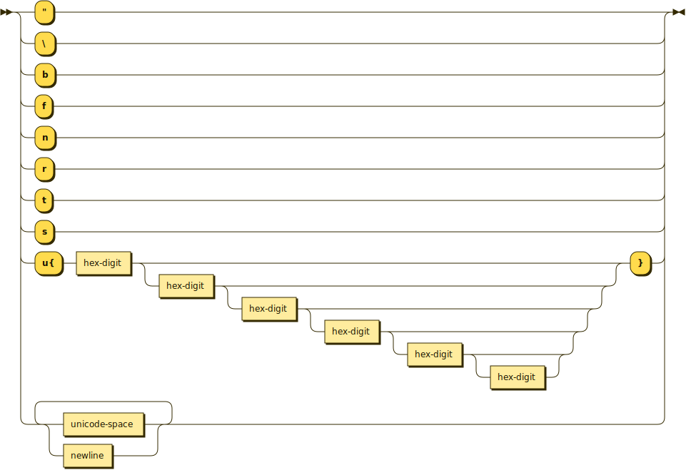

```
escape   ::= ["\bfnrts]
           | 'u{' hex-digit ( hex-digit ( hex-digit ( hex-digit ( hex-digit hex-digit? )? )? )? )? '}'
           | ( unicode-space | newline )+
```

referenced by:

* string-character

**hex-digit:**

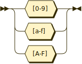

```
hex-digit
         ::= [0-9a-fA-F]
```

referenced by:

* escape
* hex

**raw-string:**

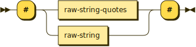

```
raw-string
         ::= '#' ( raw-string-quotes | raw-string ) '#'
```

referenced by:

* raw-string
* string

**raw-string-quotes:**

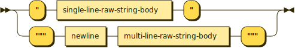

```
raw-string-quotes
         ::= '"' single-line-raw-string-body '"'
           | '"""' newline multi-line-raw-string-body '"""'
```

referenced by:

* raw-string

**single-line-raw-string-body:**

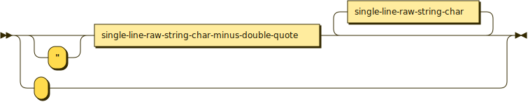

```
single-line-raw-string-body
         ::= ''
           | '"'? single-line-raw-string-char-minus-double-quote single-line-raw-string-char*
```

referenced by:

* raw-string-quotes

**number:**


```
number   ::= keyword-number
           | hex
           | octal
           | binary
           | decimal
```

referenced by:

* value

**decimal:**

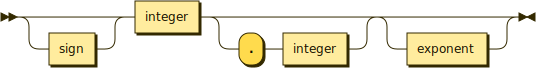

```
decimal  ::= sign? integer ( '.' integer )? exponent?
```

referenced by:

* number

**exponent:**

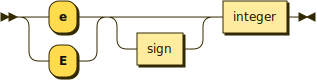

```
exponent ::= ( 'e' | 'E' ) sign? integer
```

referenced by:

* decimal

**integer:**

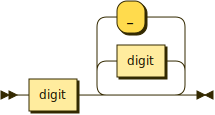

```
integer  ::= digit ( digit | '_' )*
```

referenced by:

* decimal
* exponent

**digit:**

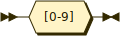

```
digit    ::= [0-9]
```

referenced by:

* integer

**sign:**

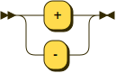

```
sign     ::= '+'
           | '-'
```

referenced by:

* binary
* decimal
* exponent
* hex
* octal

**hex:**

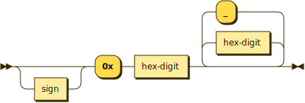

```
hex      ::= sign? '0x' hex-digit ( hex-digit | '_' )*
```

referenced by:

* number

**octal:**

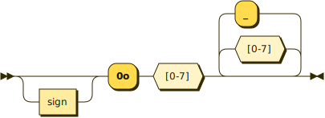

```
octal    ::= sign? '0o' [0-7] [0-7_]*
```

referenced by:

* number

**binary:**

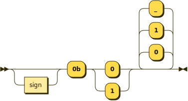

```
binary   ::= sign? '0b' ( '0' | '1' ) ( '0' | '1' | '_' )*
```

referenced by:

* number

**keyword:**

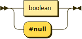

```
keyword  ::= boolean
           | '#null'
```

referenced by:

* value

**keyword-number:**

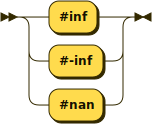

```
keyword-number
         ::= '#inf'
           | '#-inf'
           | '#nan'
```

referenced by:

* number

**boolean:**


```
boolean  ::= '#true'
           | '#false'
```

referenced by:

* keyword

**single-line-comment:**

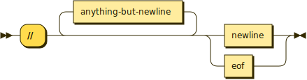

```
single-line-comment
         ::= '//' anything-but-newline* ( newline | eof )
```

referenced by:

* escline
* line-space
* node-terminator

**multi-line-comment:**

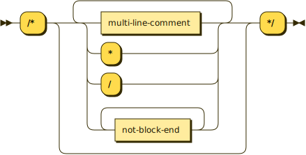

```
multi-line-comment
         ::= '/*' ( multi-line-comment | '*' | '/' | not-block-end+ )* '*/'
```

referenced by:

* multi-line-comment
* ws

**slashdash:**

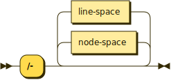

```
slashdash
         ::= '/-' ( node-space | line-space )*
```

referenced by:

* base-node

**ws:**


```
ws       ::= unicode-space
           | multi-line-comment
```

referenced by:

* escline
* line-space
* node-space

**escline:**

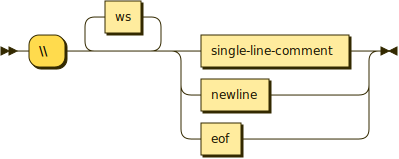

```
escline  ::= '\\' ws* ( single-line-comment | newline | eof )
```

referenced by:

* node-space

**line-space:**

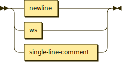

```
line-space
         ::= newline
           | ws
           | single-line-comment
```

referenced by:

* nodes
* slashdash

**node-space:**

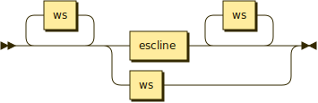

```
node-space
         ::= ws* ( escline ws* | ws )
```

referenced by:

* base-node
* prop
* slashdash
* type
* value

## 
 <sup>generated by [RR - Railroad Diagram Generator][RR]</sup>

[RR]: https://www.bottlecaps.de/rr/ui